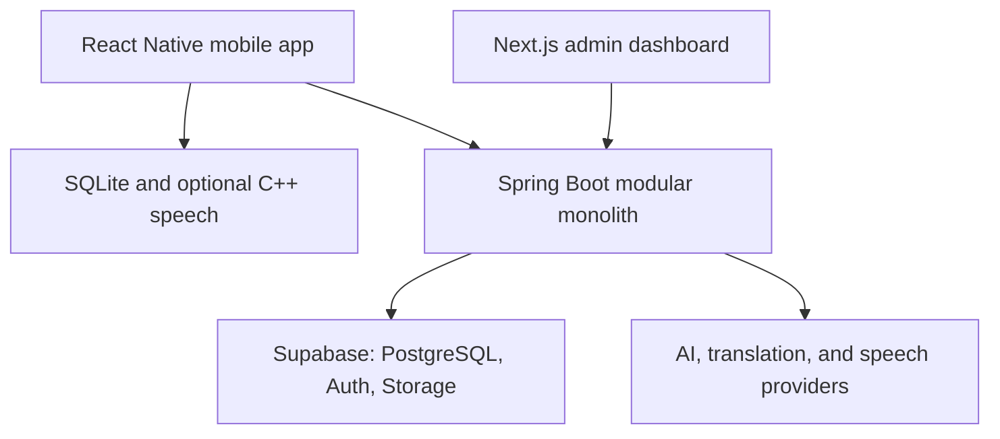
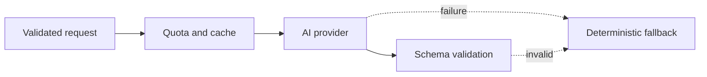

# Practical Language Learning Platform

> Product requirements, system design, technical architecture, cost plan, and implementation roadmap

**Status:** Pre-development specification  
**Initial language:** Korean  
**Initial explanation languages:** English and Vietnamese  
**Primary client:** Cross-platform mobile application  
**Primary goal:** Build a useful language-learning product and demonstrate hiring-grade software engineering  

---

## Table of Contents

1. [Executive Summary](#1-executive-summary)
2. [Problem Statement](#2-problem-statement)
3. [Product Positioning](#3-product-positioning)
4. [Target Users](#4-target-users)
5. [Product Goals and Non-Goals](#5-product-goals-and-non-goals)
6. [Language and Curriculum Scope](#6-language-and-curriculum-scope)
7. [Learning Model](#7-learning-model)
8. [Main Product Areas](#8-main-product-areas)
9. [Differentiating Features](#9-differentiating-features)
10. [Functional Requirements](#10-functional-requirements)
11. [System Architecture](#11-system-architecture)
12. [Technology Stack](#12-technology-stack)
13. [Repository Structure](#13-repository-structure)
14. [Mobile Application Architecture](#14-mobile-application-architecture)
15. [Backend Architecture](#15-backend-architecture)
16. [Admin Dashboard](#16-admin-dashboard)
17. [Database Design](#17-database-design)
18. [Offline Synchronization](#18-offline-synchronization)
19. [API Design](#19-api-design)
20. [Audio and Pronunciation](#20-audio-and-pronunciation)
21. [Optional C++ Speech Engine](#21-optional-c-speech-engine)
22. [Translation System](#22-translation-system)
23. [AI System](#23-ai-system)
24. [Content and Copyright Policy](#24-content-and-copyright-policy)
25. [Security and Privacy](#25-security-and-privacy)
26. [Testing Strategy](#26-testing-strategy)
27. [Observability and Analytics](#27-observability-and-analytics)
28. [Deployment Architecture](#28-deployment-architecture)
29. [Cost Plan](#29-cost-plan)
30. [Development Roadmap](#30-development-roadmap)
31. [MVP Acceptance Criteria](#31-mvp-acceptance-criteria)
32. [Success Metrics](#32-success-metrics)
33. [Resume and Portfolio Strategy](#33-resume-and-portfolio-strategy)
34. [Deferred Features](#34-deferred-features)
35. [Initial Engineering Backlog](#35-initial-engineering-backlog)
36. [Final Scope Decision](#36-final-scope-decision)

---

# 1. Executive Summary

This product is a free, offline-first language-learning platform that prepares learners for real conversations.

The first release will teach Korean to English- and Vietnamese-speaking learners. It will focus on absolute beginners through practical A1 content, with selected A2 travel and social scenarios.

The application is not intended to reproduce Duolingo. It addresses problems that learners may encounter in conventional language apps:

- Excessive multiple-choice recognition
- Insufficient speaking practice
- Unnatural textbook sentences
- Weak preparation for unpredictable conversations
- Limited treatment of slang, abbreviations, dialects, politeness, and cultural behavior
- Progress represented by points rather than real-world ability
- Useful functionality hidden behind subscriptions

The core product promise is:

> After completing a level, the learner should be able to perform the real-world scenarios associated with that level.

The system will combine:

- A React Native mobile application
- An offline SQLite database
- A Java and Spring Boot backend
- PostgreSQL, authentication, and storage through Supabase
- A Next.js content administration dashboard
- On-device translation and text-to-speech
- Limited, provider-neutral AI features
- An optional C++ on-device speech-analysis module

The product must continue functioning when:

- The user is offline
- The AI provider is unavailable
- AI or speech quotas are exhausted
- The backend temporarily sleeps or experiences a cold start

The complete stack is free to develop locally. A small beta can operate within free tiers, but stable public hosting and app-store distribution are not guaranteed to remain free.

---

# 2. Problem Statement

Many language learners can complete app exercises but cannot perform basic interactions in the real world.

Common problems include:

1. Learners recognize correct answers but cannot generate their own responses.
2. Exercises teach grammatically possible sentences that are uncommon in daily speech.
3. Learners do not understand differences between formal, polite, and casual speech.
4. Traditional courses do not adequately explain slang, abbreviations, fillers, texting, and regional speech.
5. Learners freeze when a real person asks an unexpected follow-up question.
6. Cultural behavior is separated from language instruction.
7. Learners receive scores without understanding their recurring weaknesses.
8. Speaking and advanced feedback are frequently paid features.

The proposed platform solves these problems through scenario-based learning, production-heavy exercises, offline access, personal error tracking, and practical cultural instruction.

---

# 3. Product Positioning

## 3.1 Product statement

> Learn the language people actually use in restaurants, airports, stores, workplaces, group chats, and everyday social situations.

## 3.2 Competitive positioning

The application should not attempt to compete through:

- The largest course catalog
- Celebrity licenses
- The most animations
- The longest streak system
- Unlimited AI generation
- Thousands of shallow exercises

It should compete through:

- Practical scenario completion
- Natural language and politeness guidance
- Speaking from the beginning
- Error-driven review
- Slang, abbreviations, dialects, and texting
- Destination-specific preparation
- Cultural rewards
- Offline access
- A meaningful free experience

## 3.3 Core value proposition

A learner should be able to answer:

- What would I say?
- How would a local person say it?
- Is this too formal, too casual, or rude?
- What might the other person ask next?
- Can I say it clearly enough to be understood?
- Can I still complete the interaction without following a memorized script?

---

# 4. Target Users

## 4.1 Primary users

- Complete Korean beginners
- Self-learners who cannot afford subscriptions or tutoring
- Travelers preparing to visit Korea
- Learners interested in Korean culture and entertainment
- Learners who know vocabulary but freeze during conversation
- English-speaking learners
- Vietnamese-speaking learners

## 4.2 Initial personas

### Persona A: First-time learner

- Cannot read Hangul
- Wants structured guidance
- Needs short explanations and immediate practice
- May feel intimidated by speaking

### Persona B: Traveler

- Has a trip within one to three months
- Needs restaurant, transportation, hotel, shopping, and emergency language
- Does not need advanced grammar before useful phrases

### Persona C: Culture-motivated learner

- Interested in Korean entertainment, food, or social culture
- Wants to understand casual expressions and reactions
- Needs help distinguishing entertainment dialogue from ordinary speech

### Persona D: False beginner

- Knows vocabulary and grammar from previous study
- Struggles to produce sentences under pressure
- Needs scenario practice and targeted correction

---

# 5. Product Goals and Non-Goals

## 5.1 Product goals

1. Teach Korean A0 through practical A1.
2. Include selected A2 travel and social scenarios.
3. Make the complete core curriculum usable without payment.
4. Work offline after content is downloaded.
5. Require learners to produce language, not only recognize it.
6. Teach natural speech, politeness, slang, and cultural context.
7. Track recurring learner errors.
8. Provide speaking feedback without claiming scientific accent measurement.
9. Demonstrate production-quality mobile, backend, database, testing, and reliability work.
10. Recruit real beta learners and use their feedback.

## 5.2 Non-goals for the first release

- Supporting ten languages
- Guaranteeing fluency
- Replacing a native tutor
- Building a social network
- Building a live tutoring marketplace
- Training a proprietary language model
- Training a proprietary speech-recognition model
- Providing unlimited AI conversations
- Hosting copyrighted television, anime, music, or celebrity material
- Implementing microservices or Kubernetes
- Supporting advanced C1/C2 learners

---

# 6. Language and Curriculum Scope

## 6.1 Launch scope

| Category | Initial scope |
|---|---|
| Target language | Korean |
| Explanation languages | English and Vietnamese |
| Complete levels | A0 and A1 |
| Partial level | Selected A2 scenarios |
| Lessons | Approximately 30–40 |
| Conversation missions | Approximately 15–20 |
| Vocabulary | Approximately 500–800 curated items |
| Concepts | Approximately 200–300 reusable concepts |

Only Korean content must be complete for version one.

The architecture must support future languages through data and configuration, but the mobile interface should not pretend that incomplete languages are available.

## 6.2 Long-term levels

| Level | Learner outcome | Delivery plan |
|---|---|---|
| A0 | Read Hangul and produce basic expressions | MVP |
| A1 | Handle essential daily and travel interactions | MVP |
| A2 | Discuss routine life, preferences, and simple experiences | Partial MVP, then expansion |
| B1 | Sustain conversations and explain opinions | Later |
| B2 | Communicate independently in social and professional contexts | Later |
| C1+ | Handle advanced nuance and specialized communication | Not an initial promise |

## 6.3 Initial Korean curriculum

### A0: Foundations

- Hangul consonants and vowels
- Syllable blocks
- Basic sound changes
- Greetings
- Introducing oneself
- Countries and languages
- Numbers
- Dates and time
- Basic sentence order
- Essential politeness

### A1: Daily survival

- Ordering food
- Cafés
- Shopping
- Asking prices
- Transportation
- Asking for directions
- Hotels
- Making simple plans
- Describing preferences
- Discussing daily routines
- Asking for help
- Medical and emergency basics
- Weather
- University and workplace introductions

### Selected A2 scenarios

- Explaining a past experience
- Making and changing plans
- Describing a problem
- Giving simple opinions
- Meeting friends
- Workplace hierarchy
- University club activities
- Social media and texting
- Understanding common casual expressions

## 6.4 Curriculum hierarchy

```text
Language
└── Level
    └── Unit
        └── Scenario
            └── Lesson
                ├── Concepts
                ├── Vocabulary
                ├── Exercises
                ├── Speaking task
                ├── Conversation mission
                └── Culture reward
```

Example:

```text
Korean
└── A1
    └── Eating Out
        └── Ordering at a Restaurant
            ├── Entering and requesting a table
            ├── Reading common menu words
            ├── Ordering politely
            ├── Responding to follow-up questions
            └── Asking for the bill
```

---

# 7. Learning Model

## 7.1 Lesson sequence

Each lesson follows this sequence:

1. Present the real-world situation.
2. Introduce essential vocabulary and expressions.
3. Explain one small grammar or politeness concept.
4. Test listening comprehension.
5. Require sentence construction.
6. Require translation or free response.
7. Require a speaking attempt.
8. Run a short mini-conversation.
9. Conduct a lesson assessment.
10. Present a culture reward.
11. Schedule future review.

The learner should begin producing language early. The first 80% of a lesson must not consist only of multiple-choice questions.

## 7.2 Exercise types

- Listen and select
- Match audio and meaning
- Arrange sentence components
- Fill in a missing word
- Translate into Korean
- Translate from Korean
- Type a free response
- Record a spoken response
- Select the appropriate politeness level
- Repair an unnatural sentence
- Respond to a conversation turn
- Complete a scenario objective

## 7.3 Mastery

Progress is stored by concept and scenario, not only by lesson.

Each concept can track:

- Number of attempts
- Recent accuracy
- Last reviewed time
- Current mastery score
- Next review time
- Common error type
- Production accuracy
- Recognition accuracy

Production performance should have more weight than recognition performance.

## 7.4 Scenario readiness

A scenario readiness score can combine:

- Required concepts mastered
- Listening performance
- Free-response performance
- Speaking clarity
- Mission completion
- Number of hints used

The product should explain this score in plain language. It should not present an unexplained AI-generated number.

---

# 8. Main Product Areas

## 8.1 Learn

The Learn area contains:

- Course path
- Levels
- Units
- Lessons
- Download controls
- Lesson progress
- Concept explanations
- Exercises

## 8.2 Missions

Missions are objective-based assessments without a fixed script.

Examples:

- Order a meal while responding to follow-up questions.
- Ask for directions and confirm that the route was understood.
- Explain a food allergy.
- Check into a hotel.
- Make weekend plans.
- Introduce oneself during a university club meeting.
- Explain a simple problem to an employee.

Mission feedback includes:

- Whether the communicative goal was achieved
- Meaning-blocking errors
- Unnatural expressions
- Politeness issues
- Speech-clarity issues
- Recommended review items

## 8.3 Review

The Review area contains:

- Vocabulary due today
- Grammar concepts due today
- Previously failed speaking prompts
- Conversation mistakes
- Politeness mistakes
- Failed scenario steps
- Saved phrases

## 8.4 Quick Translate

The translation feature contains:

- Korean to English
- English to Korean
- Korean to Vietnamese
- Vietnamese to Korean
- Text input
- Copy
- Device pronunciation
- Save to review
- Formal, polite, and casual alternatives when curated
- Literal-translation or uncertainty warning

Quick Translate is a utility, not a replacement for the course.

## 8.5 Culture

The Culture area contains:

- Culture Rewards
- Slang
- Abbreviations
- Texting conventions
- Dialects
- Regional expressions
- Politeness notes
- Cultural facts
- Entertainment-inspired language notes

## 8.6 Profile and Progress

The profile contains:

- Current course
- Level progress
- Scenario readiness
- Concepts needing work
- Speaking attempts
- Downloaded content
- AI privacy preference
- Account deletion

---

# 9. Differentiating Features

## 9.1 Real-World Scenario Engine

A scenario includes:

- Location
- Learner objective
- Role played by the system
- Required concepts
- Optional complications
- Multiple valid responses
- Success criteria
- Difficulty
- Hint policy

Example restaurant complications:

- Number of people
- Spice preference
- Dine-in or takeout
- Sold-out menu item
- Side-dish question
- Payment method

## 9.2 Local Speech Packs

Each entry contains:

- Standard expression
- Natural conversational form
- Meaning
- Formality
- Age/social context
- Region
- Potential rudeness warning
- Text-message usage
- Audio
- Example conversation

Categories:

- Slang
- Abbreviations
- Fillers
- Honorifics
- Texting
- Generational expressions
- Workplace language
- Regional speech

Native-speaker review is required before publication.

## 9.3 Destination Mode

Possible destinations:

- Seoul trip
- Busan trip
- Airport and transportation
- Restaurant survival
- University exchange
- Korean workplace
- Meeting a partner's family
- Emergency communication

Destination Mode creates a short preparation path from existing curated lessons.

It must have a deterministic version that works without AI.

## 9.4 Conversation Autopsy

After a conversation, display:

- One meaning-blocking error
- One unnatural expression
- One politeness issue
- One clarity issue
- One improved native-style response

Do not overwhelm learners by correcting every minor error.

## 9.5 Personal Error Memory

Track recurring patterns such as:

- Confusing topic and subject particles
- Using casual speech with strangers
- Missing counters
- Incorrect word order
- Repeated sound substitutions
- Translating English phrases too literally

Later reviews and lessons should deliberately revisit these patterns.

## 9.6 Drama-Inspired Practice

Create original scenes based on:

- Awkward first meetings
- Ordering delivery
- Workplace hierarchy
- Family dinners
- University clubs
- Misunderstandings between friends
- Dramatic confessions

When appropriate, show:

1. Textbook version
2. Natural everyday version
3. Entertainment-style dramatic version

Do not copy scripts, footage, character names, or copyrighted dialogue.

## 9.7 Culture Rewards

After completing a lesson or passing an exam, the learner receives:

- An original meme
- A common internet expression
- A cultural observation
- A regional expression
- A funny misunderstanding
- A drama-inspired reaction card
- A short fact

The reward should relate to the completed lesson when possible.

## 9.8 Fact of the Day

Facts must be:

- Short
- Source-backed
- Human-reviewed
- Relevant
- Saveable
- Reportable

AI can draft a fact for an editor. AI must not automatically publish facts.

---

# 10. Functional Requirements

## 10.1 Authentication

- Sign up
- Sign in
- Sign out
- Password recovery
- Session restoration
- Account deletion

## 10.2 Course content

- Browse available courses
- Enroll in Korean
- Download a unit
- View lessons
- Complete lesson steps
- Resume incomplete lessons

## 10.3 Exercises

- Render multiple exercise types
- Evaluate deterministic answers locally
- Submit free responses
- Store attempts offline
- Display explanations
- Schedule reviews

## 10.4 Speaking

- Request microphone permission
- Record audio
- Replay recording
- Obtain basic speech feedback
- Retry
- Delete recording

## 10.5 Synchronization

- Work without a network
- Store changes locally
- Retry safely
- Prevent duplicated progress
- Pull changes from another device

## 10.6 Content administration

- Create drafts
- Validate required fields
- Preview lessons
- Publish immutable versions
- Retire content
- Track sources and licenses
- Review user reports

---

# 11. System Architecture



## 11.1 Architectural decisions

- Use a modular monolith.
- Use REST for the initial API.
- Keep SQLite as the mobile local source of truth.
- Treat the backend as the canonical source for synchronized progress.
- Store lesson content as immutable published versions.
- Keep AI behind provider-neutral Java interfaces.
- Use append-only events for synchronization-sensitive learner actions.
- Avoid microservices, Kafka, Redis, Kubernetes, and a vector database during the MVP.

---

# 12. Technology Stack

## 12.1 Mobile

| Concern | Technology |
|---|---|
| Language | TypeScript |
| Framework | React Native with Expo |
| Navigation | Expo Router |
| Local database | Expo SQLite |
| Server state | TanStack Query |
| Ephemeral UI state | Zustand or React Context |
| Forms | React Hook Form |
| Validation | Zod |
| Audio | `expo-audio` |
| Text-to-speech | `expo-speech` |
| Secure storage | `expo-secure-store` |
| Connectivity | NetInfo |
| Unit/component tests | Jest and React Native Testing Library |
| Device E2E tests | Maestro |

## 12.2 Backend

| Concern | Technology |
|---|---|
| Language | Java 21 LTS |
| Framework | Spring Boot |
| Build | Gradle Kotlin DSL |
| Web API | Spring Web |
| Security | Spring Security OAuth2 Resource Server |
| Validation | Jakarta Bean Validation |
| ORM | Spring Data JPA |
| Complex SQL | `JdbcTemplate` or native SQL |
| Migrations | Flyway |
| Database | PostgreSQL |
| Local cache | Caffeine |
| Retry/circuit breaker | Resilience4j |
| Documentation | OpenAPI/Swagger |
| Health/metrics | Spring Boot Actuator and Micrometer |
| Testing | JUnit 5, Mockito, Testcontainers |
| Packaging | Docker |

## 12.3 Admin

| Concern | Technology |
|---|---|
| Framework | Next.js |
| Language | TypeScript |
| Styling | Tailwind CSS |
| Tables | TanStack Table |
| Validation | Zod |
| E2E testing | Playwright |
| Hosting | Vercel Hobby |

## 12.4 Native speech

| Concern | Technology |
|---|---|
| Language | C++20 |
| Build | CMake |
| Local ASR | `whisper.cpp` |
| Testing | GoogleTest |
| Android bridge | JNI |
| iOS bridge | Objective-C++ |
| React Native bridge | Turbo Native Module or Expo native module |

## 12.5 Platform and operations

| Concern | Technology |
|---|---|
| Hosted PostgreSQL | Supabase |
| Authentication | Supabase Auth |
| Small media storage | Supabase Storage |
| CI/CD | GitHub Actions |
| Local services | Docker Compose |
| Crash reporting | Sentry free tier |
| Product analytics | PostHog free tier or internal events |

---

# 13. Repository Structure

```text
language-platform/
├── apps/
│   ├── mobile/
│   │   ├── app/
│   │   ├── src/
│   │   │   ├── features/
│   │   │   ├── components/
│   │   │   ├── database/
│   │   │   ├── sync/
│   │   │   ├── audio/
│   │   │   ├── api/
│   │   │   └── analytics/
│   │   └── tests/
│   │
│   └── admin/
│       ├── app/
│       ├── components/
│       ├── features/
│       └── tests/
│
├── services/
│   └── api/
│       ├── src/main/java/com/project/
│       │   ├── auth/
│       │   ├── catalog/
│       │   ├── learning/
│       │   ├── assessment/
│       │   ├── progress/
│       │   ├── review/
│       │   ├── sync/
│       │   ├── conversation/
│       │   ├── pronunciation/
│       │   ├── translation/
│       │   ├── culture/
│       │   ├── analytics/
│       │   ├── admin/
│       │   ├── jobs/
│       │   └── common/
│       ├── src/main/resources/db/migration/
│       └── src/test/
│
├── native/
│   └── speech-core/
│       ├── include/
│       ├── src/
│       ├── bindings/
│       │   ├── android/
│       │   └── ios/
│       ├── models/
│       └── tests/
│
├── packages/
│   ├── api-contract/
│   ├── content-schema/
│   └── design-tokens/
│
├── evals/
│   ├── datasets/
│   ├── graders/
│   └── reports/
│
├── infrastructure/
│   ├── docker/
│   ├── compose.yaml
│   └── scripts/
│
├── docs/
│   ├── architecture/
│   ├── decisions/
│   ├── api/
│   └── product/
│
└── .github/workflows/
```

Do not add Nx, Bazel, or Kubernetes without a demonstrated need.

---

# 14. Mobile Application Architecture

## 14.1 Feature folders

Suggested features:

```text
features/
├── auth/
├── onboarding/
├── courses/
├── lessons/
├── exercises/
├── missions/
├── review/
├── translation/
├── speaking/
├── culture/
├── downloads/
└── profile/
```

Each feature may contain:

```text
feature/
├── api/
├── components/
├── hooks/
├── screens/
├── services/
├── state/
├── types/
└── tests/
```

## 14.2 State ownership

- SQLite owns durable local data.
- TanStack Query owns remote request state.
- Zustand or Context owns short-lived UI state.
- SecureStore owns authentication tokens and sensitive device settings.
- React component state owns local presentation details.

Do not duplicate complete lesson or progress state across SQLite, Zustand, and TanStack Query.

## 14.3 Local database

Suggested mobile tables:

- `local_courses`
- `local_units`
- `local_lessons`
- `local_exercises`
- `local_content_versions`
- `local_attempts`
- `local_progress`
- `local_review_items`
- `saved_phrases`
- `outbox_events`
- `sync_state`
- `downloaded_assets`

Enable SQLite WAL mode and use parameterized/prepared statements.

---

# 15. Backend Architecture

## 15.1 Modular monolith

Backend modules:

- `auth`
- `catalog`
- `learning`
- `assessment`
- `progress`
- `review`
- `sync`
- `conversation`
- `pronunciation`
- `translation`
- `culture`
- `analytics`
- `admin`
- `jobs`
- `common`

## 15.2 Internal module pattern

```text
learning/
├── api/
│   ├── LessonController.java
│   └── dto/
├── application/
│   ├── StartLessonUseCase.java
│   └── SubmitExerciseUseCase.java
├── domain/
│   ├── Lesson.java
│   ├── Exercise.java
│   └── ExerciseEvaluator.java
└── infrastructure/
    ├── LessonRepository.java
    └── JpaLessonEntity.java
```

## 15.3 Backend rules

- Controllers validate transport-level input.
- Application services coordinate use cases.
- Domain classes contain learning and scoring rules.
- Infrastructure classes own persistence and third-party integrations.
- Controllers do not contain business logic.
- JPA entities do not become API response types.
- Every external integration is hidden behind an interface.
- Use database transactions around multi-table progress changes.

## 15.4 Background jobs

AI feedback and optional cloud speech processing should use background jobs when latency is too high for a normal request.

`ai_jobs` may include:

- Job ID
- User ID
- Job type
- Input reference
- Status
- Attempt count
- Available-at timestamp
- Lease expiration
- Error category
- Created/updated timestamps

A PostgreSQL-backed worker is sufficient for the MVP. Redis and Kafka are unnecessary.

---

# 16. Admin Dashboard

The administration dashboard is required because content quality is part of the product.

## 16.1 Capabilities

- Create and edit courses
- Create units and lessons
- Create exercises
- Define accepted answers
- Define scenario branches
- Upload properly licensed assets
- Store media source and license
- Draft slang/dialect entries
- Generate AI-assisted drafts
- Review AI-assisted drafts
- Preview mobile rendering
- Publish a content version
- Retire content
- Review user reports
- Manage feature flags

## 16.2 Publishing workflow

```text
Draft
  → Validation
  → Editorial review
  → Native-speaker review
  → Preview
  → Published immutable version
  → Retired or replaced by a later version
```

Published content should not be edited in place. Corrections produce a new version.

---

# 17. Database Design

## 17.1 Content tables

- `languages`
- `courses`
- `course_levels`
- `units`
- `scenarios`
- `lessons`
- `lesson_steps`
- `concepts`
- `vocabulary_items`
- `grammar_points`
- `exercises`
- `exercise_answers`
- `dialogues`
- `dialogue_turns`
- `content_versions`

## 17.2 Learner tables

- `user_profiles`
- `course_enrollments`
- `lesson_attempts`
- `exercise_attempts`
- `scenario_attempts`
- `concept_mastery`
- `review_items`
- `review_history`
- `saved_phrases`
- `learning_goals`

## 17.3 Speech and conversation tables

- `pronunciation_attempts`
- `pronunciation_metrics`
- `conversation_sessions`
- `conversation_turns`
- `conversation_feedback`
- `user_error_patterns`

## 17.4 Culture tables

- `culture_items`
- `culture_sources`
- `media_assets`
- `slang_entries`
- `dialect_entries`
- `regional_variants`
- `content_reports`

## 17.5 Infrastructure tables

- `sync_events`
- `sync_cursors`
- `ai_jobs`
- `prompt_versions`
- `feature_flags`
- `audit_logs`

## 17.6 Important database decisions

- Use UUIDs for entities that can be created offline.
- Use immutable published lesson versions.
- Keep draft and published content separate.
- Keep exercise attempts append-only.
- Derive canonical progress on the server.
- Require source/license metadata for published media.
- Enforce a unique constraint on `(user_id, client_event_id)`.
- Use optimistic locking for editable content.
- Index common review, progress, sync, and course queries.

---

# 18. Offline Synchronization

Offline synchronization is one of the project's primary engineering features.

## 18.1 Local write flow

When the learner completes an exercise:

1. Save the attempt in SQLite.
2. Update the local interface immediately.
3. Create an outbox event with a UUID.
4. If online, send pending events in a batch.
5. The backend validates and processes the batch transactionally.
6. The backend returns acknowledgements and canonical progress.
7. The mobile application marks accepted events as synchronized.
8. The mobile application pulls server changes using a cursor.

## 18.2 Event types

```text
LESSON_STARTED
EXERCISE_SUBMITTED
LESSON_COMPLETED
REVIEW_COMPLETED
SCENARIO_COMPLETED
PRONUNCIATION_EVALUATED
PHRASE_SAVED
```

## 18.3 Event envelope

```json
{
  "eventId": "uuid",
  "eventType": "EXERCISE_SUBMITTED",
  "deviceId": "uuid",
  "clientCreatedAt": "ISO-8601",
  "contentVersion": 3,
  "payload": {}
}
```

## 18.4 Conflict rules

| Data | Rule |
|---|---|
| Exercise attempts | Append-only |
| Lesson completion | Derived by server |
| Concept mastery | Recomputed by server |
| User settings | Last-write-wins with version and timestamp |
| Published content | Immutable version |
| Saved phrases | Set semantics with stable IDs |
| Duplicate events | Ignored through idempotency constraint |

## 18.5 Retry policy

- Retry network and temporary server errors.
- Do not retry validation or authorization failures automatically.
- Use exponential backoff with jitter.
- Keep events until acknowledged.
- Limit batch size.
- Preserve original event IDs across retries.

## 18.6 Failure cases to test

- Network disappears during upload.
- Server commits but client misses the response.
- Same batch is submitted repeatedly.
- User switches between two devices.
- Content changes while the learner is offline.
- Application closes during a SQLite transaction.
- AI feedback fails after the attempt has been accepted.

---

# 19. API Design

## 19.1 Representative endpoints

```text
GET    /v1/courses
GET    /v1/courses/{courseId}
POST   /v1/courses/{courseId}/enroll

GET    /v1/lessons/{lessonId}
POST   /v1/lessons/{lessonId}/start
POST   /v1/exercises/{exerciseId}/attempts

GET    /v1/reviews/due
POST   /v1/reviews/{reviewId}/complete

POST   /v1/scenarios/{scenarioId}/sessions
POST   /v1/conversations/{sessionId}/turns
GET    /v1/conversations/{sessionId}/feedback

POST   /v1/pronunciation/assess
POST   /v1/translations
POST   /v1/saved-phrases

POST   /v1/sync/push
GET    /v1/sync/pull?cursor={cursor}

GET    /v1/culture/reward
GET    /v1/slang
GET    /v1/dialects

POST   /v1/admin/lessons
POST   /v1/admin/content/{id}/publish
POST   /v1/admin/culture/drafts
```

## 19.2 API conventions

- Prefix with `/v1`.
- Use cursor pagination.
- Use bearer authentication.
- Require idempotency keys or stable event IDs for retryable writes.
- Return a consistent error format.
- Include correlation IDs.
- Generate OpenAPI documentation.
- Do not return JPA entities directly.

## 19.3 Error response

```json
{
  "code": "CONTENT_VERSION_MISMATCH",
  "message": "The lesson version is no longer current.",
  "correlationId": "uuid",
  "details": {}
}
```

---

# 20. Audio and Pronunciation

## 20.1 Phase-one implementation

Use:

- `expo-audio` for recording and playback
- Device text-to-speech through `expo-speech`
- Native-speaker reference recordings when available
- Optional limited cloud speech allowance
- Text alignment and timing heuristics

Initial feedback:

- Expected sentence
- Recognized sentence
- Missing words
- Extra words
- Likely substitutions
- Speech duration
- Long pauses
- Speaking rate
- Retry suggestion

## 20.2 Honest product language

Call the result:

- Speech clarity
- Intelligibility
- Word coverage
- Timing feedback

Do not claim:

- Perfect accent measurement
- Native-level pronunciation certification
- Phoneme-level accuracy unless the implementation truly supports it

---

# 21. Optional C++ Speech Engine

Build the C++ module only after the core mobile application and backend work.

## 21.1 Structure

```text
speech-core/
├── audio/
│   ├── pcm_reader.cpp
│   ├── resampler.cpp
│   └── normalizer.cpp
├── vad/
│   └── voice_activity_detector.cpp
├── asr/
│   └── whisper_adapter.cpp
├── korean/
│   ├── text_normalizer.cpp
│   ├── hangul_decomposer.cpp
│   └── particle_rules.cpp
├── alignment/
│   ├── token_aligner.cpp
│   └── weighted_edit_distance.cpp
├── scoring/
│   ├── clarity_score.cpp
│   ├── timing_score.cpp
│   └── omission_score.cpp
└── bindings/
    ├── android/JNI
    └── ios/Objective-C++
```

## 21.2 Output contract

```ts
type SpeechAssessment = {
  transcript: string;
  expectedText: string;
  wordCoverage: number;
  omittedTokens: string[];
  substitutedTokens: Array<{
    expected: string;
    recognized: string;
  }>;
  speechRate: number;
  pauseCount: number;
  clarityScore: number;
  processingTimeMs: number;
};
```

## 21.3 Engineering requirements

- Processing must be cancellable.
- Raw audio remains on device in local mode.
- Measure processing time and peak memory.
- Test low-end and high-end devices.
- Handle corrupt and unsupported audio safely.
- Separate Korean text normalization from generic alignment.
- Do not block the React Native UI thread.

---

# 22. Translation System

## 22.1 Translation hierarchy

1. Use human-curated translations in lessons.
2. Use on-device ML Kit for arbitrary quick translation.
3. Use AI only for optional explanation or alternative phrasing.
4. Add an official Papago or another translation API later only if necessary.

## 22.2 Translation response

```ts
type TranslationResult = {
  sourceText: string;
  translatedText: string;
  sourceLanguage: string;
  targetLanguage: string;
  provider: "CURATED" | "ON_DEVICE" | "AI";
  formality?: "FORMAL" | "POLITE" | "CASUAL";
  warning?: string;
};
```

## 22.3 Important boundaries

- Do not scrape Google Translate or Papago.
- Label machine translation.
- Warn users that context and politeness may be inaccurate.
- Allow users to report a poor translation.
- Save a phrase only after the user confirms it.

---

# 23. AI System

AI is a supporting feature, not the product's identity.

## 23.1 AI-supported features

- Explain a learner's error
- Generate a conversation turn within a constrained scenario
- Produce Conversation Autopsy feedback
- Draft culture content for editorial review
- Suggest a personalized review order

## 23.2 Features that must not depend on AI

- Course navigation
- Lesson content
- Deterministic exercises
- Progress
- Review scheduling
- Offline learning
- Destination Mode baseline
- Culture content already published
- Saved phrases

## 23.3 Provider-neutral interfaces

```java
public interface ConversationProvider {
    ConversationTurn generateTurn(ConversationContext context);
}

public interface FeedbackProvider {
    LearnerFeedback explain(AttemptContext attempt);
}

public interface CultureDraftProvider {
    CultureDraft generateDraft(CultureRequest request);
}
```

## 23.4 AI request flow



## 23.5 Safeguards

- Structured JSON responses
- DTO/schema validation
- Daily per-user quotas
- Maximum input length
- Timeouts
- Prompt versioning
- Cached repeated explanations
- Retries only for temporary failures
- No provider keys in the mobile client
- Deterministic fallbacks
- User setting to disable AI
- No unnecessary raw audio sent to an LLM

## 23.6 Internal evaluation

Create a small internal evaluation set:

- 50–100 Korean learner-error cases
- Correctness score
- Helpfulness score
- Tone and level score
- Hallucination checks
- Politeness classification checks
- Prompt regression reports
- Latency and usage tracking

This evaluation system supports quality but should not become another flagship AI project.

---

# 24. Content and Copyright Policy

## 24.1 Permitted content

- Original illustrations
- Original meme templates
- Licensed media
- Public-domain media
- Original drama-inspired scenes
- Short facts with cited sources
- Original audio or properly licensed audio

## 24.2 Prohibited content

- Unlicensed BTS or celebrity photos
- Anime screenshots
- Manga panels
- K-drama clips
- Copied scripts
- Copied character dialogue
- Music recordings without permission
- AI-generated celebrity likenesses presented as official content

## 24.3 Media metadata

Every media asset must store:

- Original source
- Creator
- License
- Attribution requirement
- Publication status
- Reviewer
- Expiration or removal notes

---

# 25. Security and Privacy

- Supabase issues authentication tokens.
- Spring Security validates every token.
- The backend derives the user ID from the token.
- Never trust a `userId` supplied by the client.
- Roles are `LEARNER`, `EDITOR`, and `ADMIN`.
- API keys remain on the backend.
- Delete raw audio after processing by default.
- Local speech mode keeps audio on device.
- Use signed asset URLs when appropriate.
- Record administrative actions in audit logs.
- Rate-limit translation, AI, and speech requests.
- Never log tokens, full conversations, or raw audio.
- Allow users to delete accounts and learning data.
- Do not send sensitive learner content to a free AI tier that may use inputs for product improvement.

---

# 26. Testing Strategy

## 26.1 Backend tests

- Mastery calculation unit tests
- Exercise-evaluation unit tests
- Security and authorization tests
- Controller tests
- PostgreSQL repository tests with Testcontainers
- Flyway migration tests
- Duplicate sync-event tests
- Transaction rollback tests
- AI timeout and fallback tests
- Content-version tests

## 26.2 Mobile tests

- Component tests
- SQLite repository tests
- Lesson state-machine tests
- Outbox tests
- Retry tests
- Offline-mode tests
- Permission tests
- Navigation tests

## 26.3 End-to-end mobile flows

- Sign up
- Enroll in Korean
- Download a unit
- Complete a lesson offline
- Reconnect and synchronize
- Complete a review
- Record a speaking attempt
- Receive a Culture Reward

## 26.4 C++ tests

- Korean text normalization
- Hangul decomposition
- Token alignment
- Weighted edit distance
- Empty/corrupt audio
- Performance benchmarks
- Android/iOS binding contracts

## 26.5 Admin tests

- Create a lesson
- Validate exercises
- Preview content
- Publish a version
- Reject media without license metadata
- Replace a published version

## 26.6 CI workflow

```text
Mobile lint → Type check → Unit tests
Backend compile → Unit tests → Testcontainers tests
Admin lint → Tests → Production build
C++ build → GoogleTest
Flyway migration validation
OpenAPI compatibility check
```

---

# 27. Observability and Analytics

## 27.1 Technical metrics

- API latency
- API error rate
- Database query duration
- Synchronization failure rate
- Synchronization retry count
- AI latency
- AI fallback rate
- Background-job queue age
- Speech-processing time
- Mobile crash-free sessions

## 27.2 Product metrics

- Lesson completion
- First mission completion
- Seven-day return rate
- Review completion
- Scenario pass rate
- Speaking-feature adoption
- Improvement after retry
- Destination Mode completion
- Saved phrases later reviewed

## 27.3 North-star metric

> Percentage of active learners who successfully complete at least one unrehearsed real-world conversation mission per week.

---

# 28. Deployment Architecture

## 28.1 Local development

```text
Mobile simulator/device
    ↓
Spring Boot API in Docker or local JVM
    ↓
Local PostgreSQL through Docker Compose
```

Use local development before connecting every environment to Supabase.

## 28.2 Beta deployment

```text
Mobile development build or Android APK
    ↓
Spring Boot Docker container on free/sleeping host
    ↓
Supabase Free PostgreSQL/Auth/Storage

Admin dashboard
    ↓
Vercel Hobby
```

## 28.3 Production-minded deployment

- Keep environment variables outside the repository.
- Use separate development and production databases.
- Run migrations during controlled deployment.
- Add health and readiness endpoints.
- Add hard usage limits for AI and speech.
- Create database backups before major changes.
- Use a paid API host only when the beta justifies it.

---

# 29. Cost Plan

## 29.1 Completely free development technologies

- React Native
- Expo framework and local tools
- TypeScript
- Java
- Spring Boot
- PostgreSQL locally
- SQLite
- Next.js
- Tailwind CSS
- Docker
- C++ and CMake
- `whisper.cpp`
- JUnit, Mockito, and Testcontainers
- Jest and React Native Testing Library
- Maestro
- Flyway Community
- OpenAPI
- Git and GitHub repositories

The complete system can be built and tested locally for **$0**.

## 29.2 Free tiers with limitations

| Service | Free use | Limitation |
|---|---|---|
| Supabase | Database, authentication, storage | Usage limits; free projects may pause |
| Vercel | Admin dashboard | Personal/small-project limits |
| GitHub Actions | CI/CD | Private-repository quotas |
| Gemini API | Limited AI requests | Rate limits; free-tier data terms |
| Expo cloud builds | Limited builds | Build queues and quotas |
| Sentry/PostHog | Monitoring and analytics | Event limits |
| Free Java host | API hosting | Sleeping, cold starts, memory constraints |

## 29.3 Likely future expenses

### Stable Java hosting

The most likely operational expense is an always-available Spring Boot container.

Expected small-beta cost if free hosting becomes insufficient:

- Approximately **$5–15 per month**

### App stores

- Google Play: currently approximately **$25 one time**
- Apple Developer Program: currently approximately **$99 per year**

These are unnecessary during local development and early testing.

### AI and cloud speech

AI and advanced cloud pronunciation become usage-based after free quotas.

Control cost through:

- Per-user daily limits
- Short prompts
- Caching
- Deterministic feedback
- On-device translation
- Device TTS
- Optional local C++ speech processing

### Domain

A custom domain is optional and generally costs approximately $10–20 per year.

### Licensed media

Avoid paid media licensing by using original or permissively licensed assets.

## 29.4 Recommended zero-cost beta configuration

| Component | Choice |
|---|---|
| Mobile | React Native and Expo |
| Local storage | SQLite |
| Backend | Java and Spring Boot |
| Hosted data/auth | Supabase Free |
| API hosting | Free sleeping container |
| Admin | Next.js on Vercel Hobby |
| Translation | ML Kit on device |
| Text-to-speech | Device TTS |
| Basic pronunciation | Local transcription/comparison |
| Advanced pronunciation | Optional C++/`whisper.cpp` |
| AI | Free tier with strict quotas |
| Culture assets | Original content |
| CI/CD | GitHub Actions |
| Distribution | Direct Android APK and demo video |

## 29.5 Cost verdict

| Stage | Expected cost |
|---|---:|
| Local development | $0 |
| Portfolio demonstration | $0 |
| Small beta with free/sleeping services | $0 |
| Google Play publication | Approximately $25 one time |
| Apple App Store publication | Approximately $99/year |
| Stable backend later | Approximately $5–15/month |
| Larger AI/speech usage | Usage-dependent |

The correct promise is:

> The core application is free for learners, while infrastructure usage is controlled through on-device processing, quotas, caching, and deterministic fallbacks.

Do not promise that an unlimited production service will cost the developer $0 forever.

---

# 30. Development Roadmap

## Phase 1: Product foundation — 1 week

- [ ] Finalize the A0–A1 curriculum
- [ ] Select the first three scenarios
- [ ] Define content JSON/schema
- [ ] Create low-fidelity wireframes
- [ ] Define scenario success criteria
- [ ] Record architecture decisions

## Phase 2: Backend foundation — 2 weeks

- [ ] Create the Spring Boot project
- [ ] Configure Gradle
- [ ] Add PostgreSQL
- [ ] Add Flyway
- [ ] Add Supabase JWT validation
- [ ] Implement course and lesson APIs
- [ ] Add Docker Compose
- [ ] Add OpenAPI
- [ ] Add Testcontainers

## Phase 3: Learning vertical slice — 2 weeks

- [ ] Create the Expo mobile project
- [ ] Add navigation
- [ ] Add SQLite
- [ ] Implement one complete unit
- [ ] Implement the exercise engine
- [ ] Store attempts locally
- [ ] Implement progress
- [ ] Add device TTS
- [ ] Add basic review scheduling

**Milestone:** A learner can install the app and complete one meaningful lesson.

## Phase 4: Offline synchronization — 2 weeks

- [ ] Implement the local outbox
- [ ] Implement sync push
- [ ] Implement sync pull
- [ ] Add cursors
- [ ] Add idempotency
- [ ] Add retry/backoff
- [ ] Add duplicate and multi-device tests

**Milestone:** A learner can complete a lesson offline and synchronize later without duplicated progress.

## Phase 5: Practical differentiation — 2 weeks

- [ ] Quick Translate
- [ ] Saved phrases
- [ ] Destination Mode
- [ ] Slang and abbreviations
- [ ] Culture Rewards
- [ ] Drama-inspired lessons
- [ ] Fact of the Day

## Phase 6: Speaking and AI — 2 weeks

- [ ] Record and replay audio
- [ ] Implement basic transcription
- [ ] Implement conversation missions
- [ ] Add AI explanations
- [ ] Add Conversation Autopsy
- [ ] Add quotas
- [ ] Add cache
- [ ] Add deterministic fallbacks

## Phase 7: Admin and beta — 2 weeks

- [ ] Build the content dashboard
- [ ] Add publishing workflow
- [ ] Add license/source tracking
- [ ] Add monitoring
- [ ] Recruit 10–30 beta users
- [ ] Collect feedback
- [ ] Fix high-impact issues

## Phase 8: Optional C++ engine — 3–5 weeks

- [ ] Create speech-core library
- [ ] Add Korean normalization
- [ ] Add text alignment
- [ ] Test local transcription
- [ ] Create Android binding
- [ ] Create iOS binding
- [ ] Add benchmarks
- [ ] Compare local and provider results

Estimated duration:

- Core MVP: approximately 12 weeks
- Polished MVP plus C++: approximately 15–18 weeks

---

# 31. MVP Acceptance Criteria

The MVP is complete when:

- [ ] A new user can create an account.
- [ ] The user can enroll in Korean.
- [ ] At least one complete A0/A1 unit is available.
- [ ] The unit can be downloaded.
- [ ] The user can complete the unit offline.
- [ ] Attempts synchronize without duplication.
- [ ] At least five exercise types work.
- [ ] At least one speaking exercise works.
- [ ] At least one conversation mission works.
- [ ] Review items are scheduled from mistakes.
- [ ] Quick Translate works for Korean and English.
- [ ] The user can save translated phrases.
- [ ] A Culture Reward appears after lesson completion.
- [ ] AI failure does not prevent lesson completion.
- [ ] The admin can publish a new lesson version.
- [ ] Core backend integration tests pass.
- [ ] Core mobile E2E flow passes.
- [ ] At least ten real learners have tested the application.

---

# 32. Success Metrics

## 32.1 Technical

- More than 99% of valid sync events are eventually acknowledged.
- Duplicate submissions do not create duplicate progress.
- Core lesson flows work without internet.
- AI-provider failure does not block core functionality.
- The application does not retain raw audio by default.
- CI validates mobile, backend, database migrations, and admin builds.

## 32.2 Product

- At least 10–30 beta learners
- At least 60% completion for the first lesson
- At least 30% completion for the first conversation mission
- Measurable improvement on repeated failed scenarios
- Qualitative reports that expressions feel useful and natural

Do not invent metrics for the resume. Report only measured results.

---

# 33. Resume and Portfolio Strategy

The project's value is not the phrase “AI-powered language app.”

Its value comes from demonstrating:

- Cross-platform mobile engineering
- Java and Spring Boot backend development
- PostgreSQL data modeling
- Offline-first synchronization
- Transactions and idempotency
- Native C++ integration
- Audio processing
- Responsible AI integration
- Automated testing
- CI/CD
- Security and privacy
- Product ownership
- Real user feedback

## 33.1 Evidence to publish

- Architecture diagram
- Short demo video
- Sync design explanation
- Database diagram
- Test and CI status
- Performance measurements
- Product screenshots
- Beta-user results
- Engineering decision records
- Cost and fallback design

## 33.2 Future resume bullet template

> Built and launched an offline-first Korean conversation platform using React Native, Java/Spring Boot, PostgreSQL, and C++; designed idempotent two-way synchronization, scenario-based speech assessment, and provider-agnostic AI feedback, supporting **X** beta learners with **Y%** lesson completion and **Z%** successful synchronization.

Replace placeholders only with real measurements.

---

# 34. Deferred Features

Do not build these during the MVP:

- Multiple complete languages
- Public social feed
- Live tutor marketplace
- User-created public courses
- Real-time multiplayer
- Video lessons
- Unlimited AI chat
- Custom foundation model
- Custom speech-model training
- Full B2/C1 curriculum
- Vector database
- Redis
- Kafka
- Microservices
- Kubernetes
- Terraform
- AWS infrastructure
- Licensed celebrity or television content
- Automatic publication of AI-generated cultural facts

---

# 35. Initial Engineering Backlog

## Epic 1: Repository and development environment

- [ ] Create monorepo
- [ ] Add root README
- [ ] Add contribution guide
- [ ] Add code formatting
- [ ] Add environment-variable templates
- [ ] Add Docker Compose
- [ ] Add GitHub Actions

## Epic 2: Authentication

- [ ] Configure Supabase project
- [ ] Implement mobile authentication
- [ ] Store tokens securely
- [ ] Validate JWT in Spring Security
- [ ] Add learner and admin roles
- [ ] Add authorization tests

## Epic 3: Content catalog

- [ ] Create Flyway schema
- [ ] Create course entities
- [ ] Create lesson entities
- [ ] Create concept entities
- [ ] Create exercise entities
- [ ] Build catalog endpoints
- [ ] Seed one Korean unit

## Epic 4: Mobile lesson engine

- [ ] Create SQLite schema
- [ ] Build lesson renderer
- [ ] Build exercise registry
- [ ] Implement deterministic evaluation
- [ ] Store attempts
- [ ] Resume interrupted lessons

## Epic 5: Progress and review

- [ ] Implement concept mastery
- [ ] Implement review scheduling
- [ ] Build review screen
- [ ] Track recognition versus production
- [ ] Add failed-concept recommendations

## Epic 6: Synchronization

- [ ] Create outbox schema
- [ ] Create sync event format
- [ ] Implement push
- [ ] Implement pull
- [ ] Add server cursor
- [ ] Add retry policy
- [ ] Add duplicate-event tests

## Epic 7: Culture

- [ ] Create culture schema
- [ ] Build Culture Reward component
- [ ] Add source/license fields
- [ ] Create original assets
- [ ] Add report function

## Epic 8: Translation

- [ ] Add on-device translation
- [ ] Add language-model download state
- [ ] Add copy and TTS
- [ ] Add saved phrases
- [ ] Add machine-translation warning

## Epic 9: Speaking

- [ ] Add microphone permission flow
- [ ] Add recording
- [ ] Add playback
- [ ] Add basic transcription
- [ ] Add word alignment
- [ ] Add clarity feedback

## Epic 10: AI

- [ ] Define provider interfaces
- [ ] Add one provider
- [ ] Add schemas
- [ ] Add quotas
- [ ] Add caching
- [ ] Add timeouts
- [ ] Add deterministic fallback
- [ ] Create evaluation dataset

## Epic 11: Admin

- [ ] Add editor authentication
- [ ] Build lesson editor
- [ ] Build exercise editor
- [ ] Add preview
- [ ] Add validation
- [ ] Add publishing
- [ ] Add audit log

## Epic 12: Beta

- [ ] Deploy backend
- [ ] Deploy admin
- [ ] Generate Android beta build
- [ ] Recruit testers
- [ ] Add feedback form
- [ ] Measure funnel
- [ ] Prioritize observed problems

---

# 36. Final Scope Decision

Build:

- Korean first
- English and Vietnamese explanations
- A0 through practical A1
- Selected A2 travel and social scenarios
- Mobile-first and offline-first
- Java/Spring Boot modular monolith
- PostgreSQL and Supabase Auth
- Next.js content administration
- On-device translation and text-to-speech
- Limited AI with deterministic fallback
- Optional C++ speech engine after the core product works

Do not build another major project until this one has:

- A working end-to-end release
- A real deployment
- Meaningful automated tests
- At least 10–30 external testers
- Measured product results
- A documented architecture
- A polished demonstration

The best version of this project is not the version with the most features. It is the version that reliably helps a real learner complete a practical Korean conversation and proves that its developer can design, build, test, deploy, and improve a complete software product.

